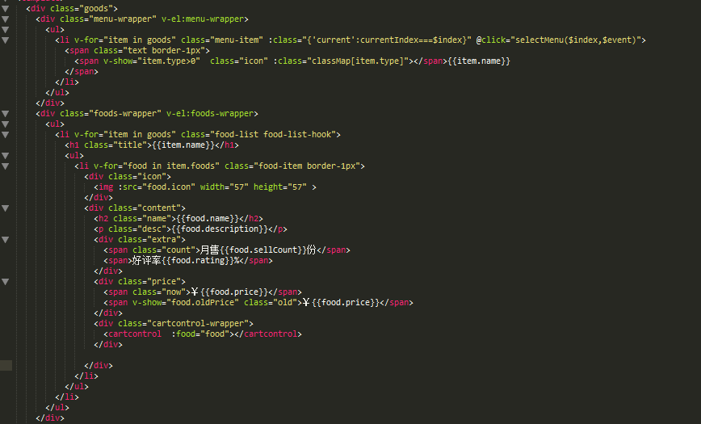
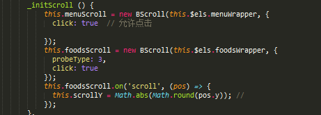
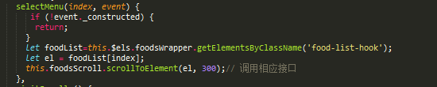
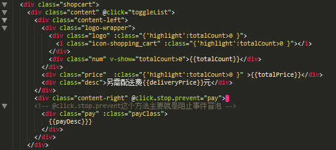
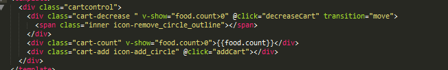
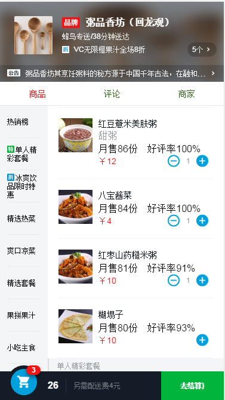
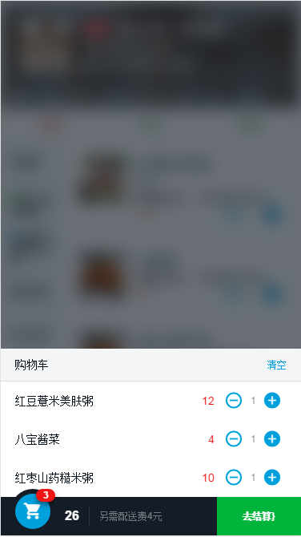
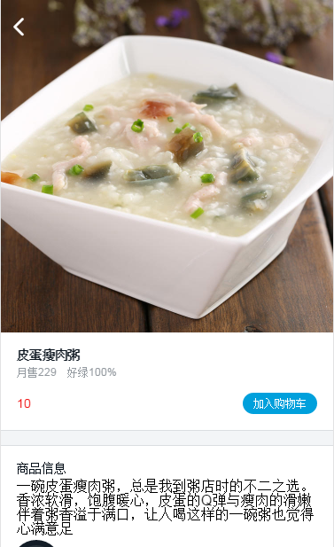
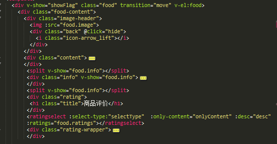
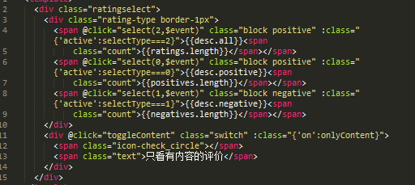

# vue 项目开发 整体流程

[TOC]

## 项目目录


> 这两个文件夹主要是webpack的配置文件相关内容


> 通过node安装的项目依赖


> 存放开发的源码


> 存放第三方静态资源文件，现在其中的文件是，在改文件夹为空时，依旧可以提交到github上面。


> 配置将es6文件，转化为es5

## 项目运行的过程

* 小知识点，在使用组件之前，一定要在script代码中注册：

```javascript
 components: {
    Hello
  }
```

* webpack是如何进行打包

  * webpack.base.conf.js文件详述

  ```javascript
    entry: {
      app: './src/main.js'//入口文件
    },
    output: {
      path: config.build.assetsRoot,
      publicPath: process.env.NODE_ENV === 'production' ? config.build.assetsPublicPath : config.dev.assetsPublicPath,
      filename: '[name].js'
    },
    resolve: {
      extensions: ['', '.js', '.vue'],//自动获取后缀名
      fallback: [path.join(__dirname, '../node_modules')],
      alias: {
        'src': path.resolve(__dirname, '../src'),
        'assets': path.resolve(__dirname, '../src/assets'),
        'components': path.resolve(__dirname, '../src/components')
      }//引入文件相关配置
  ```

> 配置基本文件，入口出口，和基本处理方法

* webpack.dev.conf.js

```javascript
// add hot-reload related code to entry chunks
Object.keys(baseWebpackConfig.entry).forEach(function (name) {
  baseWebpackConfig.entry[name] = ['./build/dev-client'].concat(baseWebpackConfig.entry[name])
})//启动hot-reload的方法
```


* 如何去mock数据，进行模拟

> 首先引入数据文件


> 然后在dev-server.js中进行接口的设置并且进行访问


> 页面设置内容如上所示。这样就将数据准备完毕从而进行操作实验


* vue-router的使用


> 利用vuerouter进行基本配置。
>
> 在html中只需要利用v-link
>
> 在运用完毕之后利用router-view来进行页面的跳转展示。

## header组件开发

* vue-resource 的使用


> 通过这个方法对数据进行请求，由于这里是mock的数据，当实际情况时就可以进行更改。其中的一个问题，就是.json()方法返回的现在已经不是object对象了

* header组件主要结构如下图所示


> 根据设计稿布局出相应的页面在这个其中还用到了一个新的子组件那就是star

* star组件的结构如下图所示


> 在star组件中最重要的就是将评分的星星合理的动态展示出来，这里用到的方法主要是通过传入参数，来进行参数计算主要代码如下：


> 主要通过设定一个数组，来计算传入的分数，然后计算星星全颗的半颗的和全暗的数量，从而来展示响应的星星。

* header小词条


```html
<div v-if="seller.supports" class="support">
          <span class="icon" :class="classMap[seller.supports[1].type]"></span>
          <!-- 根据class来显示合适的图片以及下面的文字描述内容。 -->
          <span class="text">{{seller.supports[1].description}}</span>
        </div>
```

> 由上述代码所示，根据相对应的type来展示相对应的小图标

* 最终实现header组件的成果如下


## goods 组件的开发

> 开发goods组件中需要首先根据分析，又把good组件分成了三个小的组件

* goods组件
* shopcart子组件表示购物车部分
* cartcontrol子组件表示数量加减的部分

### goods组件部分

> goods组件主要分成两块，一块是菜单部分，另外一块是食物列表的部分

* menu菜单部分

> 1.通过v-for循环遍历goods来列出所有的菜单。 goods的数据来源通过vue-resource来进行获取
>
> ```javascript
> this.$http.get('/api/goods').then((response) => {
>         console.log(response.body);
>         response=response.body;
>         if (response.errno === 0) {
>           this.goods=response.data;
>           console.log(this.goods);
>           this.$nextTick(() => { // dom 更新以后执行
>             this._initScroll();
>             this._calculateHeight();
>           });
>         }
>       });
>
> ```

> 2.要显示小图标，通过v-show这个指令来判断是否有并且展示出来

* food内容部分

> 1.和菜单记录一样，通过v-for循环遍历出来所有的数据列表



> goods主要内容区域的结构内容如上图所示

* 拖动的插件better-scroll




> 首先要计算出偏移的值然后通过selectMenu方法根据点击来竖直移动相对应的foodlist



> 在开发这里基本都是利用数据来进行驱动，不过有几个地方是要使用到dom的。
>
> v-el在vue1.0中是用来绑定dom结构的，但是，在vue2.0中已经被废弃了，我这里主要还是进行1.0的开发，所以还是使用的v-el
>
> 这里使用的方法是这样的在div中使用v-el:"name" 在方法中调用的形式是
>
> this.els.name  这里需要注意的是在html结构中要使用羊肉串命名，例如name-one 在js中要使用驼峰命名法。

* 注意点

  > 因为在vue中没有dom的概念，在执行时需要加上this.$nextTick()来监听dom更新时的状态。

### shopcart组件部分

> shopcart 主要由两个部分组成，一个部分是购物车 的部分一部分是结算的部分



>  页面结构如图所示。
>
>  这里有一个部分是显示出半圆的结构那么这个结构使用了一个小技巧在计算盒模型大小的时候使用了IE的盒模型来显示半圆，
>
>  box-sizing:border-box
>
>  通过这一的设置展现出来半圆形突出来

* shopcart-list

> 这里需要遍历所选择的食物并且展示出来。首先要有selectfood这个数据。通过props来接受这个数据
>
> 并且通过判断其中是否有数据，来表示是否展现出这个购物车详情页面
>
> ```javascript
> toggleList() {
>         if (!this.totalCount) {
>           return;
>         }
>         this.fold=!this.fold;
>       }
> ```

* 在这里遇到的一个问题

> 在购物车详情页面中，也需要将better-scroll插件引入，在引入这个插件的过程中也需要获取dom页面，不知道为什么this.els.listContent获取到的数据为undefind ，但是获取this.els是可以获取到的，一时间不知道如何解决这个，之后我改变了了语句使用了如下语句
>
> this.$els["'listContent'"]通过这一的语句我获得了相对应的变量
>
> 剩下的基本上都是根据数据来驱动变化

### cartcontrol组件

> 这个组件主要是加减商品的



> 其结构图如上图所示。这里主要就是写了两个方法，将count加减展示出来。
>
> 这个部分还有一个问题就是动画部分还没有实现，先留下一个坑过后再填

### 界面展示






> 以上就是goods组件的开发过程

## food组件的开发

> food组件主要是商品点击的时候，所展现的商品详情页面。
>
> 
>
> 界面详情就是这样子了。
>
> 
>
> 页面结构如上图所示。

* 因为是需要在点击的时候，导入详情页面，需要在goods中引入food组件，并且设置层级覆盖在页面之上。
* food组件中需要使用的数据，是food。所以需要props:接收数据。在goods组件中绑定food数据。绑定的数据是选中的数据，传入。
* food组件默认隐藏。当点击事件的时候，显示。
* 加入购物车需要引入cartcontrol组件，并且当food.count为0的时候显示加入购物车这几个字。

```javascript
//加入购物车需要绑定一个方法，第一次加入时增加food.count
addFirst(event) {
  			if (!event._constructed) {
  				return;
  			}
  			Vue.set(this.food, 'count', 1);
  		}
```

> 通过绑定事件，设置food的值。

### food里的评价页面

* 开发ratingselect组件，评价页面主要就是一个选项卡的组件通过type的判断，来显示相对应的评价内容。



> selectrating 的主要结构上图所示。具体方法都在代码中。


