# vue 项目开发 整体流程

[TOC]

## 项目目录

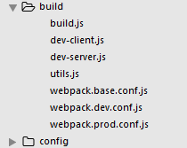

> 这两个文件夹主要是webpack的配置文件相关内容


> 通过node安装的项目依赖

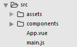

> 存放开发的源码

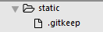

> 存放第三方静态资源文件，现在其中的文件是，在改文件夹为空时，依旧可以提交到github上面。


> 配置将es6文件，转化为es5

## 项目运行的过程

* 小知识点，在使用组件之前，一定要在script代码中注册：

```javascript
 components: {
    Hello
  }
```

* webpack是如何进行打包

  * webpack.base.conf.js文件详述

  ```javascript
    entry: {
      app: './src/main.js'//入口文件
    },
    output: {
      path: config.build.assetsRoot,
      publicPath: process.env.NODE_ENV === 'production' ? config.build.assetsPublicPath : config.dev.assetsPublicPath,
      filename: '[name].js'
    },
    resolve: {
      extensions: ['', '.js', '.vue'],//自动获取后缀名
      fallback: [path.join(__dirname, '../node_modules')],
      alias: {
        'src': path.resolve(__dirname, '../src'),
        'assets': path.resolve(__dirname, '../src/assets'),
        'components': path.resolve(__dirname, '../src/components')
      }//引入文件相关配置
  ```

> 配置基本文件，入口出口，和基本处理方法

* webpack.dev.conf.js

```javascript
// add hot-reload related code to entry chunks
Object.keys(baseWebpackConfig.entry).forEach(function (name) {
  baseWebpackConfig.entry[name] = ['./build/dev-client'].concat(baseWebpackConfig.entry[name])
})//启动hot-reload的方法
```

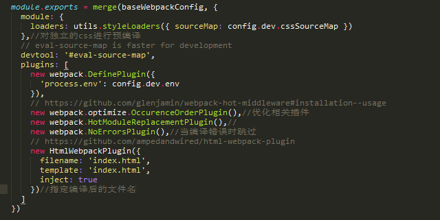

* 如何去mock数据，进行模拟

> 首先引入数据文件


> 然后在dev-server.js中进行接口的设置并且进行访问

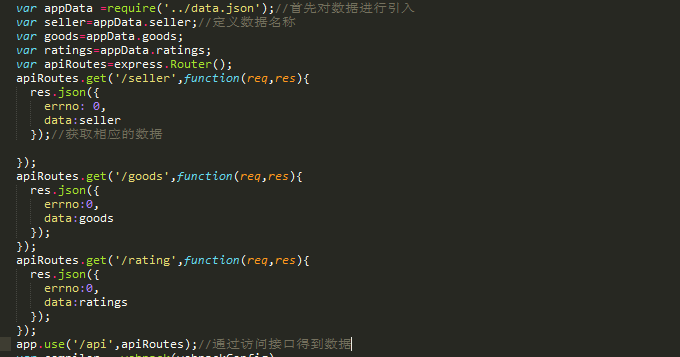

> 页面设置内容如上所示。这样就将数据准备完毕从而进行操作实验


* vue-router的使用

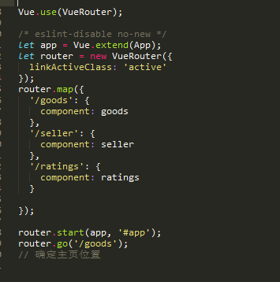

> 利用vuerouter进行基本配置。
>
> 在html中只需要利用v-link
>
> 在运用完毕之后利用router-view来进行页面的跳转展示。

## header组件开发

* vue-resource 的使用

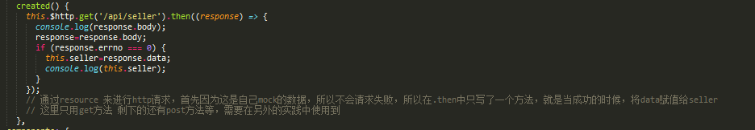

> 通过这个方法对数据进行请求，由于这里是mock的数据，当实际情况时就可以进行更改。其中的一个问题，就是.json()方法返回的现在已经不是object对象了

* header组件主要结构如下图所示

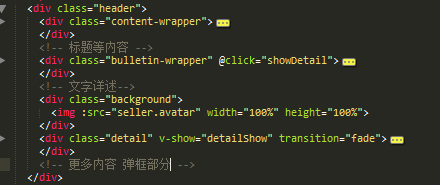

> 根据设计稿布局出相应的页面在这个其中还用到了一个新的子组件那就是star

* star组件的结构如下图所示

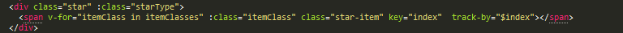

> 在star组件中最重要的就是将评分的星星合理的动态展示出来，这里用到的方法主要是通过传入参数，来进行参数计算主要代码如下：

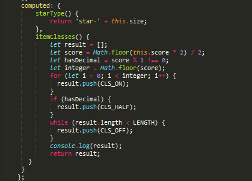

> 主要通过设定一个数组，来计算传入的分数，然后计算星星全颗的半颗的和全暗的数量，从而来展示响应的星星。

* header小词条

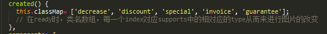

```html
<div v-if="seller.supports" class="support">
          <span class="icon" :class="classMap[seller.supports[1].type]"></span>
          <!-- 根据class来显示合适的图片以及下面的文字描述内容。 -->
          <span class="text">{{seller.supports[1].description}}</span>
        </div>
```

> 由上述代码所示，根据相对应的type来展示相对应的小图标

* 最终实现header组件的成果如下

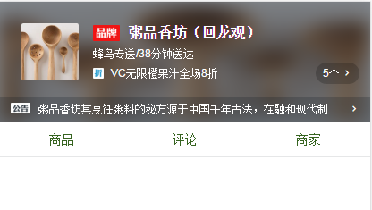

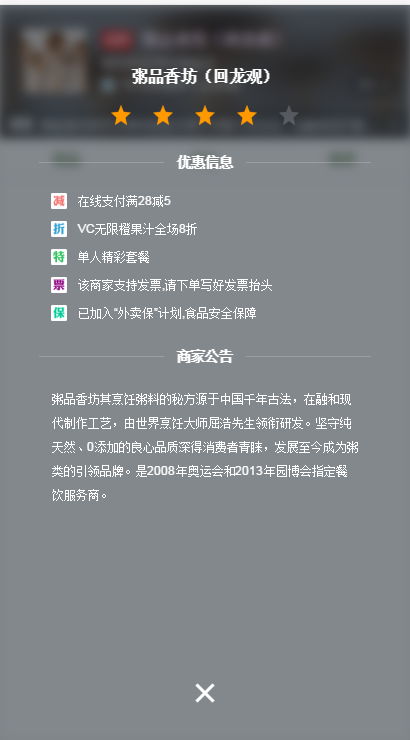

## goods 组件的开发

