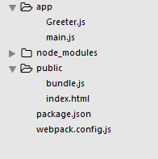

###  webpack 实操指南 

####  全局安装webpack

```shell
npm install -g webpack#全局安装webpack
npm install -dev--save webpack #在项目目录之下本地安装webpack
#在目录下建立npm项目
npm init #建立项目
```

#####  建立最基本的webpack打包的项目



##### 如上图所示

index.html 用来加载打包后的程序bundle.js其代码如下所示

```html
<!DOCTYPE html>
<html lang="en">
  <head>
    <meta charset="utf-8">
    <title>Webpack Sample Project</title>
  </head>
  <body>
    <div id='root'>
    </div>
    <script src="bundle.js"></script>
  </body>
</html>
```

Greeter.js用来输出内容代码内容如下

```js
module.exports = function() {
  var greet = document.createElement('div');
  greet.textContent = "Hi there and greetings!";
  return greet;
};
```

Main.js用来讲模块内容输入主页面中

```js
var greeter = require('./Greeter.js');
document.getElementById('root').appendChild(greeter());
```

最重要的事情要发生了，配置webpack.config.js,新建一个这样的文件，之后将如下代码写入文件中

```js
module.exports = {
  entry:  __dirname + "/app/main.js",//已多次提及的唯一入口文件
  output: {
    path: __dirname + "/public",//打包后的文件存放的地方
    filename: "bundle.js"//打包后输出文件的文件名
  }
}
//__dirname是一个node.js的全局变量，其返回的值内容是当前文件夹下的目录。
```

接下来需要做的事情就是将文件进行打包在文件目录下打开shell输入

```shell
webpack #该命令就可以根据webpack.config.js内的配置内容来进行打包操作
```

为了更加方便的使用webpack我们将webpack命令加入node.js的特殊脚本之中，在package.json中加入如下配置，

```json
 "scripts": {
    "start": "webpack" 
  }
//通过加入这样的命令之后就可以可以使用npm start来进行打包活动
```

##### webpack调试功能

```javascript
module.exports = {
  devtool:"eval-source-map"
  entry:  __dirname + "/app/main.js",//已多次提及的唯一入口文件
  output: {
    path: __dirname + "/public",//打包后的文件存放的地方
    filename: "bundle.js"//打包后输出文件的文件名
  }
}//通过配置文件打开调试功能
```

##### 使用webpack构建本地服务器。

```shell
#在本地安装sever
npm install --save-dev webpack-dev-server
```

```js
//将配置信息加入config中
 devServer: {
    contentBase: "./public",//本地服务器所加载的页面所在的目录
    colors: true,//终端中输出结果为彩色
    historyApiFallback: true,//不跳转
    inline: true//实时刷新
  }

```

```shell
#执行命令
webpack-dev-server #创建本地服务器，并且运行起来，将该服务器命令加入到node中
```

```shell
#配置信息如下所示
"scripts": {
    "start": "webpack",
    "dev":"webpack-dev-server --devtool eval --progress --colors --hot --content-base build"
  }
  #通过 配置，之后就可以使用命令npm run dev 来进行本地服务器的搭建
```

#### webpack Loaders

###### 通过loader来加载处理各种脚本文件

每一个loader需要单独安装，并且需要在config中配置代码例子如下所示

```shell
npm install --save-dev json-loader
```

```javascript
 module: {//在配置文件里添加JSON loader
    loaders: [
      {
        test: /\.json$/,
        loader: "json"
      }
    ]
  }//通过配置来添加loader
```

#### 基本上就是以上几种用法

